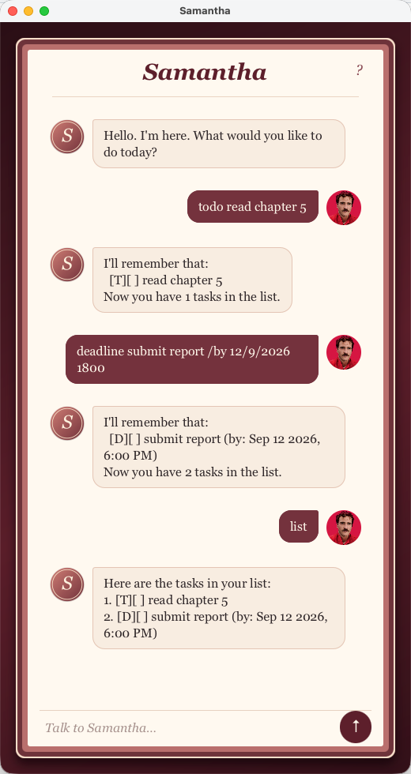

# Samantha

Samantha is a personal assistant for tasks and notes. Type a command in the window or in a terminal — the commands are the same.

## Quick start

1. Ensure that Java `25` is installed.
2. Open Samantha's window (from IntelliJ, or by running `./gradlew run` in the project folder).
3. Type a command in the box at the bottom and press **Enter**. Try:

    * `todo read chapter 5` — adds a task
    * `list` — shows every task
    * `help` — opens the command guide in the window (or prints it in the terminal)

4. Refer to [Features](#features) for every command.

In the window, **?** also opens the guide. Select a command there and press `c` to copy an example.

## Features

> **Notes about the command format:**
>
> * Words in `UPPER_CASE` are values you type. For example, in `todo DESCRIPTION`, replace `DESCRIPTION` with `read chapter 5`.
> * Items in square brackets are optional. For example, `list [DATE]` can be `list` or `list 12/9/2026`.
> * Dates use `d/M/yyyy` or `d-M-yyyy`, for example `12/9/2026` or `12-9-2026`.
> * Times use `HHmm` in 24-hour form, for example `1800` for 6:00 PM.
> * Task and note numbers are the numbers shown by `list` or `notes`. They start at `1`.

### Viewing help: `help`

Shows how to use Samantha.

Format: `help`

In the window, `help` or **?** opens a separate guide. In the terminal, Samantha prints the same commands as text.

If she does not recognize a command, the word **help** in her reply is clickable. After three unrecognized commands in a row, she opens the guide herself.

### Adding a todo: `todo`

Adds a task with no date.

Format: `todo DESCRIPTION`

Examples:

* `todo read chapter 5`
* `todo buy oat milk`

### Adding a deadline: `deadline`

Adds a task that is due on a date, optionally at a time.

Format: `deadline DESCRIPTION /by DATE [TIME]`

* The date is required. The time is optional.
* If you omit the time, the deadline is for that calendar day.

Examples:

* `deadline submit report /by 12/9/2026 1800`
* `deadline return book /by 2/12/2019`

### Adding an event: `event`

Adds an event with a start and an end.

Format: `event DESCRIPTION /from DATE TIME /to DATE TIME`

* Both `/from` and `/to` need a date and a time.
* The end must be after the start.
* An event can only have one `/from` and one `/to`.

Examples:

* `event project meeting /from 12/9/2026 1400 /to 12/9/2026 1600`

### Listing tasks: `list`

Shows your tasks.

Format: `list [DATE]`

* `list` shows every task, including todos.
* `list DATE` shows only deadlines on that day, and events that cover that day. Todos are omitted, because they have no date.
* The numbers in the list are the numbers you use with `mark`, `unmark`, and `delete`.

Examples:

* `list`
* `list 12/9/2026`

### Finding tasks and notes: `find`

Finds tasks and notes whose text contains the given words.

Format: `find KEYWORD`

* The search is case-insensitive; `Report` matches `submit report`.
* The rest of the line is treated as one phrase. `find chapter 5` looks for `chapter 5`, not for `chapter` or `5` separately.
* Partial words match; `chap` matches `read chapter 5`.
* Tasks and notes are listed in separate sections. The numbers are the original `list` / `notes` numbers.

Examples:

* `find report`
* `find chapter 5`

### Marking a task done: `mark`

Marks a task as done.

Format: `mark INDEX`

* `INDEX` is the number shown by `list`.

Examples:

* `list` followed by `mark 1` marks the first task done.

### Marking a task as not done: `unmark`

Marks a completed task as not done yet.

Format: `unmark INDEX`

Examples:

* `unmark 1`

### Deleting a task: `delete`

Removes a task from the list.

Format: `delete INDEX`

* Later tasks are renumbered.

Examples:

* `list` followed by `delete 2` removes the second task.

### Adding a note: `note`

Saves a free-form note. Notes are separate from tasks.

Format: `note TEXT`

Examples:

* `note buy oat milk`
* `note movie title: Interstellar`

### Listing notes: `notes`

Shows every saved note.

Format: `notes`

### Editing a note: `edit-note`

Replaces the text of an existing note.

Format: `edit-note INDEX TEXT`

* `INDEX` is the number shown by `notes`.

Examples:

* `notes` followed by `edit-note 1 buy oat milk and bread`

### Deleting a note: `delete-note`

Removes a note.

Format: `delete-note INDEX`

Examples:

* `delete-note 1`

### Undoing the last change: `undo`

Reverses the most recent command that changed a task or a note.

Format: `undo`

* `undo` itself cannot be undone.
* Commands that only display information (`list`, `find`, `help`, `notes`) are not undone.
* Extra words after `undo` are rejected.

Examples:

* `todo read chapter 5` followed by `undo` removes that todo.

### Exiting: `bye`

Closes Samantha.

Format: `bye`

### Saving the data

Samantha saves after every command that changes a task or a note. You do not need to save manually.

Tasks are stored in `data/samantha.txt`. Notes are stored in `data/notes.txt`.

If a saved file is missing, Samantha starts with an empty list. If a file is corrupted or unreadable, she warns you and continues with an empty list for that file.

## FAQ

**Q:** How do I use Samantha on another computer?
**A:** Copy the `data` folder (with `samantha.txt` and `notes.txt`) into the project folder on the other computer.

## Command summary

| Action | Format | Example |
| --- | --- | --- |
| Help | `help` | `help` |
| Add a todo | `todo DESCRIPTION` | `todo read chapter 5` |
| Add a deadline | `deadline DESCRIPTION /by DATE [TIME]` | `deadline submit report /by 12/9/2026 1800` |
| Add an event | `event DESCRIPTION /from DATE TIME /to DATE TIME` | `event project meeting /from 12/9/2026 1400 /to 12/9/2026 1600` |
| List tasks | `list [DATE]` | `list 12/9/2026` |
| Find | `find KEYWORD` | `find report` |
| Mark done | `mark INDEX` | `mark 1` |
| Mark not done | `unmark INDEX` | `unmark 1` |
| Delete a task | `delete INDEX` | `delete 2` |
| Add a note | `note TEXT` | `note buy oat milk` |
| List notes | `notes` | `notes` |
| Edit a note | `edit-note INDEX TEXT` | `edit-note 1 buy oat milk and bread` |
| Delete a note | `delete-note INDEX` | `delete-note 1` |
| Undo | `undo` | `undo` |
| Exit | `bye` | `bye` |
